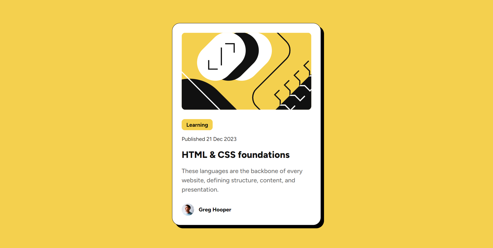

# Frontend Mentor - Blog preview card solution

This is a solution to the [Blog preview card challenge on Frontend Mentor](https://www.frontendmentor.io/challenges/blog-preview-card-ckPaj01IcS). Frontend Mentor challenges help you improve your coding skills by building realistic projects. 

## Table of contents

- [Frontend Mentor - Blog preview card solution](#frontend-mentor---blog-preview-card-solution)
  - [Table of contents](#table-of-contents)
  - [Overview](#overview)
    - [The challenge](#the-challenge)
    - [Screenshot](#screenshot)
    - [Links](#links)
  - [My process](#my-process)
    - [Built with](#built-with)
    - [What I learned](#what-i-learned)
  - [Author](#author)


## Overview

### The challenge

Users should be able to:

- See hover and focus states for all interactive elements on the page

### Screenshot



### Links

- Solution URL: [solution URL here](https://www.frontendmentor.io/solutions/use-pure-css-flexbox-to-creating-a-qr-code-page-eP3F_OmMBd)
- Live Site URL: [live site URL here](https://angel-retry.github.io/blog-preview-card/)

## My process

### Built with

- Semantic HTML5 markup
- CSS custom properties
- Flexbox
- Desktop-first workflow

### What I learned

Load font types using static files.
```css
@font-face {
  font-family: "Figtree";
  src: url("./assets/fonts/Figtree-VariableFont_wght.ttf")
    format("truetype");
  font-weight: 100 900; /* Define the font-weight range */
}
```

Use `width: max-content;` allows the width to adjust based on the width of the child elements.

```css
width: max-content;
```

## Author

- Website - [@angel-retry](https://github.com/angel-retry)

